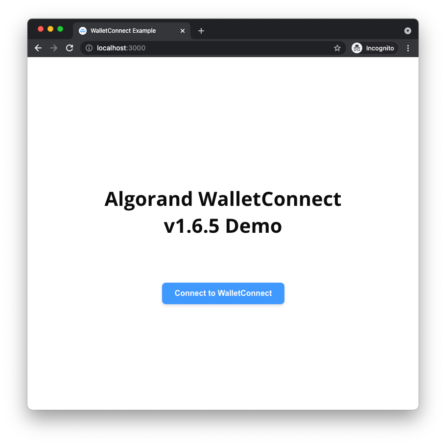
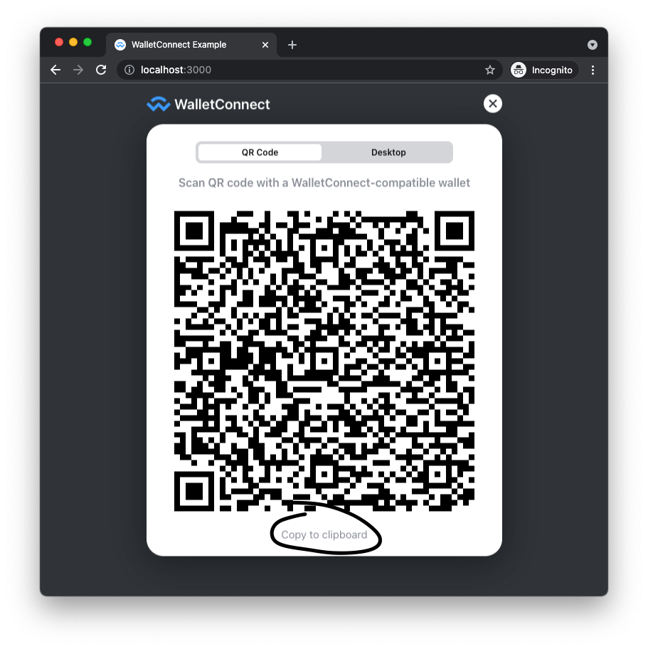
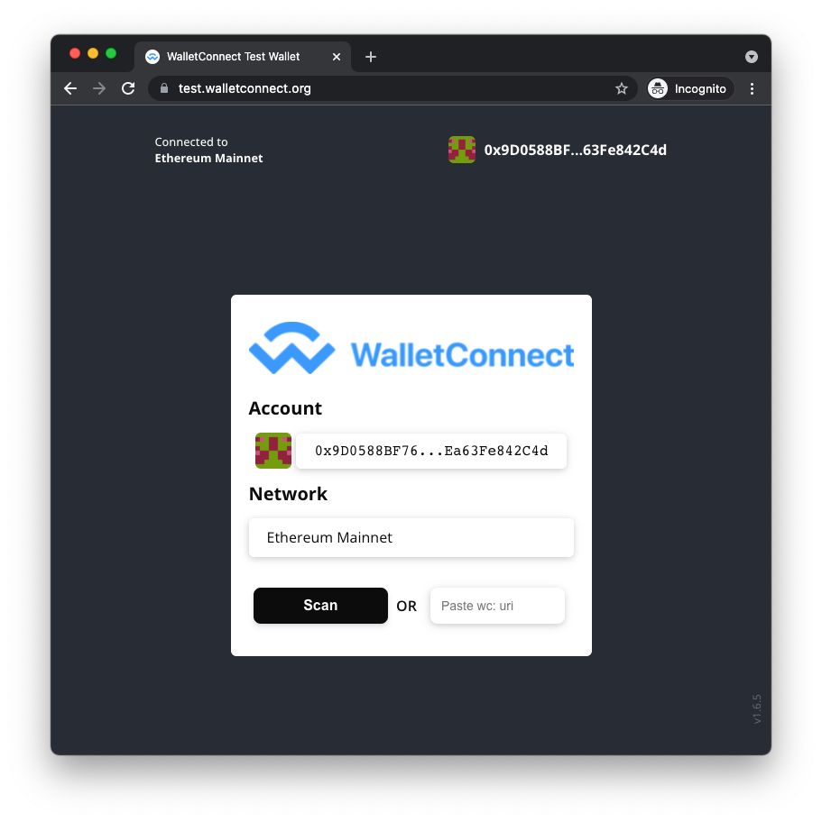
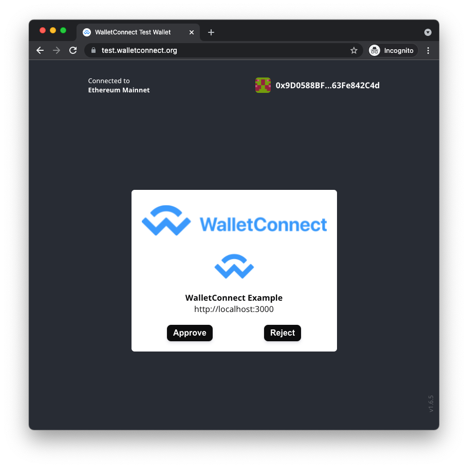
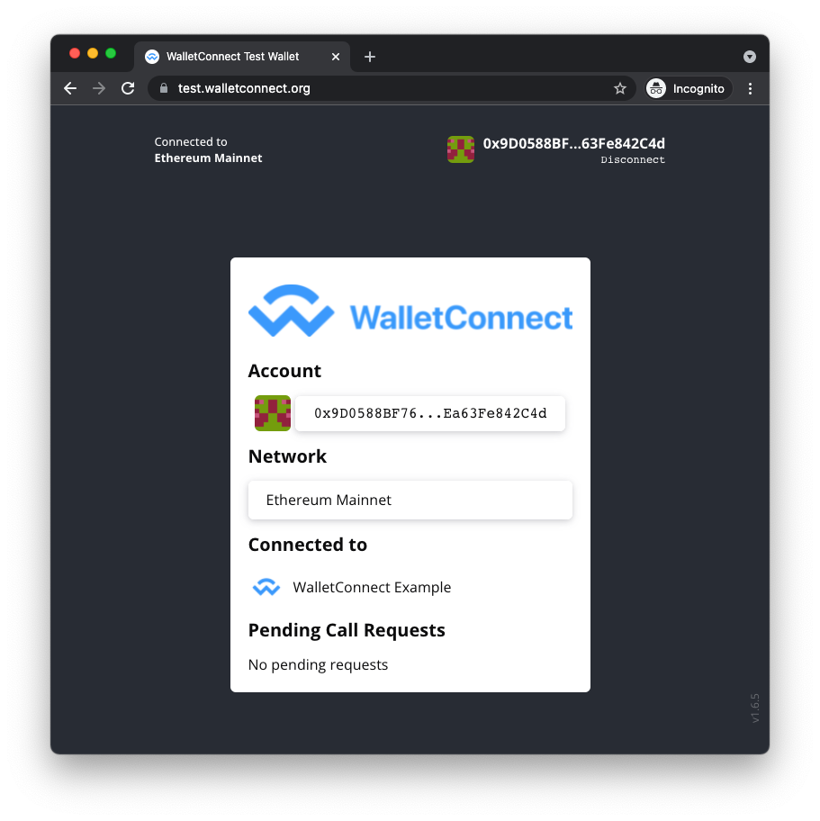

# Wallet Connect Bridge Automation

This deploys https://github.com/aktionariat/walletconnect-bridge.git to our EKS clusters. While we are sharing this automation for others to benefit, the Algorand team does NOT make warranties regarding the stability / reliability of the referenced bridge implementation. Please research and make decisions around use at your own discretion.

For 2.0 support, see the v2.0 branch. It uses https://github.com/WalletConnect/walletconnect-monorepo.git

## Scripts

### scripts/build.sh

This builds a docker image for the walletconnect bridge. It currently versions through a timestamp and will produce two docker images, for example:

```
walletconnect/relay-server:latest
walletconnect/relay-server:latest-java
walletconnect/relay-server:1633462163-java
```

### scripts/push.sh

```
$ scripts/push.sh -h
Usage: scripts/push.sh <-i IMAGE> [-r AWS_REGION] [-h]
```

This script pushes images to ECR. It will check the aws account that the shell it runs in has credentials to talk to and creates the ECR repo if it does not already exist. It then pushes the image with the appropriate tag.

```
scripts/push.sh -i walletconnect/relay-server:1633456298-java
```

### scripts/deploy.sh

```
$ scripts/deploy.sh -h
Usage: scripts/deploy.sh [-l VERSION] [-r AWS_REGION] [-n NAMESPACE] [-c CLASSIFIER] [-h]
```

This script will deploy to the kubernetes cluster that shell it runs in has access to. When ingress is enabled, it is very opinionated about running with nginx ingress controller, external-dns and lets-encrypt. If you would like to use the settings shown here for your ingress rule, make sure that your lb supporting the ingress controller can handle the timeout.

### scripts/status.sh

```
scripts/status.sh -h
Usage: scripts/status.sh [-n NAMESPACE] [-c CLASSIFIER] [-h]
```

This script shows some data about a deployed service.

```
scripts/status.sh
VERSION: 1633456298-java
ENDPOINT: wss://wallet-connect.default.dev.example.com/
NAME                                                     READY   STATUS    RESTARTS   AGE
wallet-connect-bridge-default-default-59669996d4-vr6bd   1/1     Running   0          15m
```


## Test

### Run DAPP locally

Clone the algorand example dapp repository.

```
git clone https://github.com/algorand/walletconnect-example-dapp
```

Go in the page config and edit it to use your endpoint. You can find this using the status script shown before.

You need to change bridge variable in `src/App.tsx` to do this. https://github.com/algorand/walletconnect-example-dapp/blob/master/src/App.tsx#L179

Next you need to start the app. You will get a notification to allow your shell to use chrome. Please approve this.

```
npm install
npm run start
```

After following these steps you should see something like the following.



### Wallet Connect Flow

Once you have a demo app running and configured to use your wallet connect bridge endpoint, you can try to register it with a wallet.

Navigate to the dapp in your browser, probably running in http://localhost:3000.


Click "Connect to WalletConnect" and you will see a QR code



This QR code is what you need to use to integrate the demo dapp with your wallet. Copy the QR code and then you can navigate to https://test.walletconnect.org/ and test it out.



Paste the copied QR code where it says "Paste wc: url"

Check the console logs in dev tools if you run into any issues while working with this site.



You will be prompted to either accept or reject integrating with your demo dapp. Click "Approve"



If you see the following screen, your integration has been successful!

